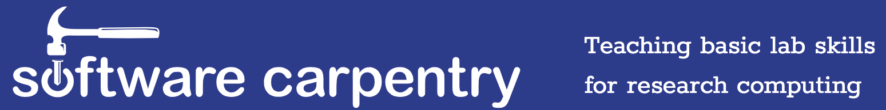
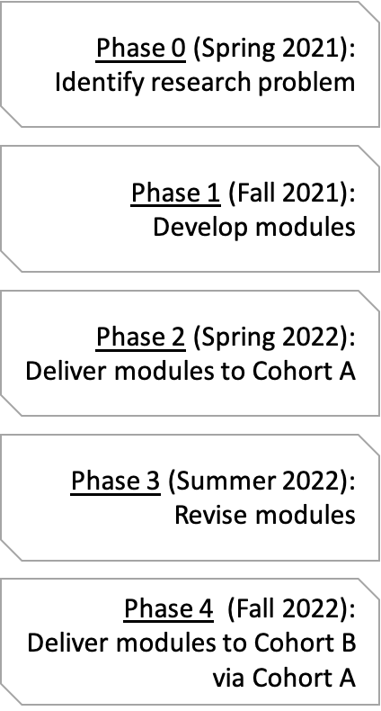
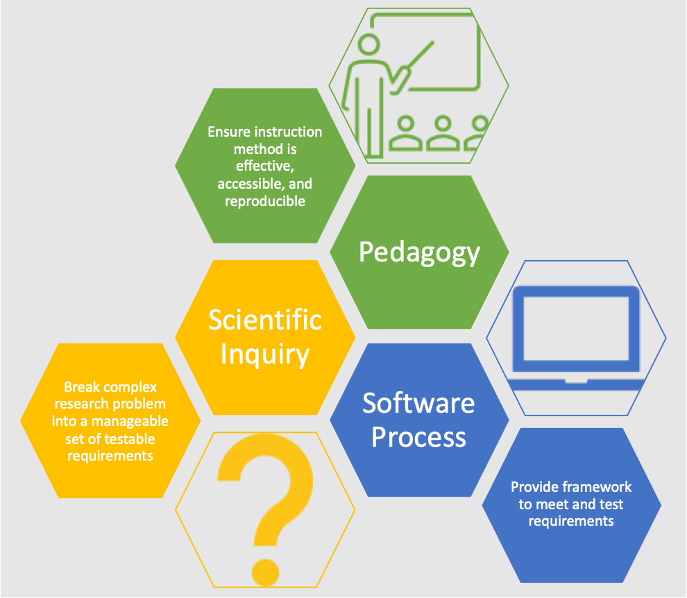
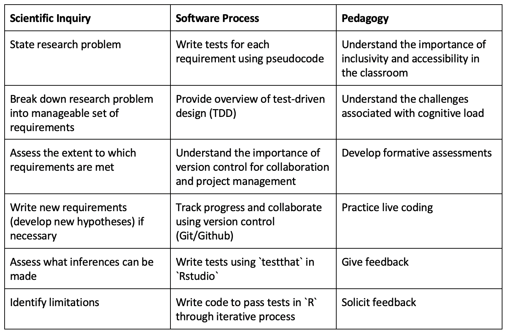

## Outline


```r
ipsum_items <- replicate(5, lorem::ipsum_words(5))
cat(paste("-", ipsum_items), sep = "\n")
```

```
## - auctor metus tincidunt morbi mus
## - in primis praesent gravida tincidunt
## - gravida dis interdum nullam mi
## - ut sed sagittis ultrices conubia
## - imperdiet netus facilisi habitant ligula
```

--- .segue h2 bg:darkslategray

## Introduction

--- 

## Big questions


```r
ipsum_items <- replicate(2, lorem::ipsum_words(5))
cat(paste("-", ipsum_items), sep = "\n")
```

```
## - sed scelerisque lacus urna ante
## - bibendum curabitur dignissim vestibulum nullam
```

<div style="position: absolute; bottom: 4em; left: 5em; font-weight: bold; color: #fff; font-size: 11px;">
<p style="font-size: 20px">Citation (YYYY)<br>Citation (YYYY)</p>
</div>

---

## Problem


```r
ipsum_items <- replicate(2, lorem::ipsum_words(5))
cat(paste("-", ipsum_items), sep = "\n")
```

```
## - imperdiet integer nascetur senectus sociis
## - commodo sociosqu cum tincidunt nisl
```

--- &twocol

## Escape-and-radiate coevolution

> "Ipsum montes iaculis neque torquent urna sem senectus quam? Tellus a etiam cubilia nam mus praesent fermentum maecenas. Varius tristique venenatis malesuada conubia massa risus suscipit lectus senectus class tellus porttitor rhoncus. Suspendisse dui nunc sed class! Dui neque cum tempus primis ac diam porttitor. Nullam ut tortor massa magnis parturient cubilia tincidunt libero lacus cras lacus facilisi tincidunt fermentum natoque magna mollis nullam praesent aptent tempor euismod posuere aptent fames suscipit euismod praesent fermentum natoque gravida hac facilisi libero torquent auctor cursus ridiculus duis montes eleifend mollis montes himenaeos sagittis sapien cursus dignissim donec luctus lobortis venenatis ornare urna congue parturient interdum metus parturient vestibulum tincidunt nisi mollis ante dis quisque dictumst aenean sagittis id taciti tempor mauris auctor nam dapibus!"
>
>  &mdash; Citation (YYYY)

*** {name: left}

<H3 align="left">Let's say we start with</H3>

<div style="position: absolute; bottom: 5em; right: 5em; font-weight: bold; color: #fff; font-size: 11px;">
<p style="font-size: 20px">Citation (YYYY)<br>Citation2 (YYYY) </p>
</div>

--- .segue h2 bg:darkslategray

## Software process meets the scientific method

---

## A train-the-trainer model of computational empowerment for biologists

- Technology &#8594; data!
- Cumbersome datasets
- Foundational computational tools &#10003;



---

## A train-the-trainer model of computational empowerment for biologists

- Technology &#8594; data!
- Cumbersome datasets
- Foundational computational tools &#10003;

## Problem

No practical experience integrating software process into scientific method


---

## Objective

To specifically tailor development of a new <b>Vertically Integrated Project (VIP) course</b> focusing on how software process tools such as <em>version control</em> and <em>test-driven development</em> can help meet the needs of researchers while supporting the reproducibility of science

---

## Objective

To specifically tailor development of a new <b>Vertically Integrated Project (VIP) course</b> focusing on how software process tools such as <em>version control</em> and <em>test-driven development</em> can help meet the needs of researchers while supporting the reproducibility of science

## Overview

- Work with EPSCoR researchers to identify a suitable problem and dataset
- Create modules to walk through solving problem using software process
- Deliver modules through VIP course
- Self-sustaining by design

---

## VIP <br> Phases 



---

## Conceptual<br>framework




---

## Learning objectives



--- &twocol

## Recruitment plan

*** =left

<b>Cohort A</b>

- Certified Carpentry instructors
- IMCI-sponsored Carpentries workshops
- Flyer distributed widely

*** =right

--- &twocol

## Recruitment plan

*** =left

<b>Cohort A</b>

- Certified Carpentry instructors
- IMCI-sponsored Carpentries workshops
- Flyer distributed widely

*** =right

<b>Cohort B</b>

- Undergraduate research offices
- SSS-TRiO
- SACNAS
- Palouse Pathways

---

## Research goals

- Consult with EPSCoR affiliates to identify a suitable research problem 

> - Erect a novel pedagogical framework 
> - Science education paper introducing the new train-the-trainer model

---

## Data acquisition

- Survey participants' confidence before and after course in  ` `
    - Writing code to analyze large, cumbersome datasets 
    - Teaching computational skills to novices and intermediate learners 

> - Collaborate to identify other metrics for comparison (e.g., extent to which learning objectives met) ` `
> - Examine the reproducibility of code `  `
> - Assess extent to which product meets the desired requirements `  `

---

## Data acquisition

- Survey participants' confidence before and after course in - `improve`
    - Writing code to analyze large, cumbersome datasets 
    - Teaching computational skills to novices and intermediate learners
- Collaborate to identify other metrics for comparison (e.g., extent to which learning objectives met) - `equal gains`
- Examine the reproducibility of code - `good`
- Assess extent to which product meets the desired requirements - `good`

---

## Ethics

- IRB (Human Research Protections) Coordinator at UI
    - Exempt Category 1 or 2
    - Human subjects training
    - Data handled and stored securely
    - Participation voluntary (Informed Consent Form) 
- Responsible Conduct of Research training 

--- .segue h2 bg:darkslategray

## Summary

---

## Intellectual merit

> 1. First-author paper: performance of methods in detecting escape-and-radiate coevolution
> 2. Phylogenetic meta-analysis: role of coevolution on lineage diversification
> 3. Pedagogical innovation paper: train-the-trainer model of computational empowerment for biologists

---

## Broader impacts

> 1. Foundation for cophylogenetic comparative framework
> 2. Empowerment of more diverse, collaborative, and inclusive professoriate
> 3. Support reproducibility of science 
> 4. Increase computational literacy of biologists
> 5. Independent research experiences for 3 undergraduates
> 6. Doctoral training for me

--- &twocol

## Acknowledgements 

*** {name: left}
<b>BCB</b><br>

*** {name: right}
<br><br><br>

<b>Co-working friends</b><br>

<b>Resources</b><br>
NSF GRFP, IMCI, EPSCoR GEM3 VIP<br>
IBEST CRC<br>
Raven Scholars, CDAR, CTC<br>
COGS, Dean of Students


--- {
 tpl: thankyou,
 social: [{title: email, href: "sipl0809@vandals.uidaho.edu"}]
}

## Thank You

<br>
 
