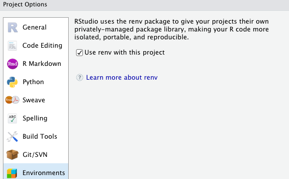
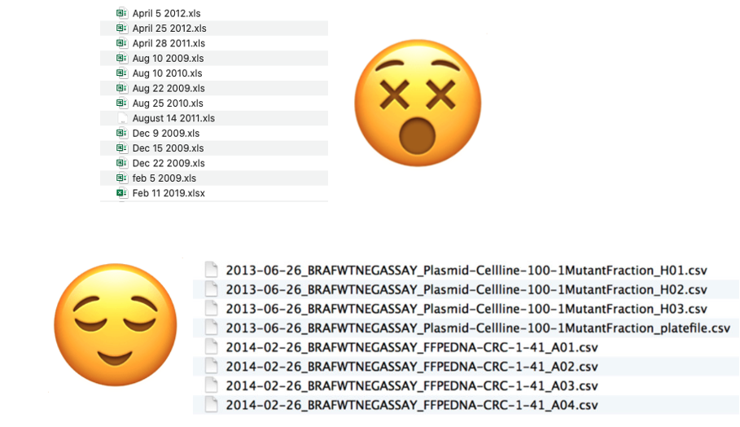

```{r setup, include=FALSE}
knitr::opts_chunk$set(echo = FALSE)
```

class: center

# What We Will Discuss:

--

## Saving source and blank slates

--

## Project-oriented workflow

--

## Safe paths for reproducibility

--

## Naming files

---

class: inverse, center, middle

# Saving source and blank slates

---


---

# Use an IDE


---
# Start with a blank slate


---

# Avoid hidden dependencies

What is wrong with `rm(list = ls())`?

--

- Falls short of providing a blank slate

--

- Better strategy is to restart R

--

### Restart R often!


---

# When power-cycling is not practical

- e.g. your analysis contains parts that take a long time to execute

--

- Modular approach:
  - Break an analysis into logical steps
  
  - Utilize `saveRDS()` and `readRDS()`
  
---

class: inverse, center, middle

# Project-oriented workflow

---

# RStudio Projects

--

- Helps with keeping files associated with a project together

--

- Automatically starts at the working directory for the project (eliminate the need for `setwd("path/that/only/works/on/one/particular/machine")`)

--

- Easy to switch from project A to project B

---

# `renv` package

- Addresses package-dependency issue

--

- You can turn it on in Project Options:



More info: [vignette](https://rstudio.github.io/renv/articles/renv.html)

---

# Benefits of working in a project

--

## - File system discipline

--

## - Working directory intentionality

--

## - File path discipline

---

class: inverse, center, middle

# Practice safe paths

---

# Habits conducive to safe paths:

--

1. Organize by projects

--

2. Make top-level project folder clear

--

  - If you use RStudio Projects, you'll see `.Rproj` file
  
  
.center[]

--

*Extra Credit: *

*This folder was created a few years ago when I was just learning R. What bad habit did I have that shows in this screenshot?*

---

# `here` package

Use the `here()` function to build the path when you read or write a file.

- Creates paths relative to the top-level directory

```{r eval=FALSE, echo=TRUE}
library(ggplot2)
library(here)

df <- read.delim(here("data", "raw_foofy_data.csv"))
p <- ggplot(df, aes(x, y)) + geom_point()
ggsave(here("figs", "foofy_scatterplot.png"))
```

--

More info: [vignette](https://cran.r-project.org/web/packages/here/vignettes/here.html)

[Using `here` with rmarkdown](https://cran.r-project.org/web/packages/here/vignettes/rmarkdown.html)

---

class: inverse, center, middle

# Naming files

---

# Ideal file names should be...

--

## - Machine readable

--

## - Human readable

--

## - Plays well with default ordering

---


---

# Machine-readable file names

- Regular expression and globbing friendly

  - Avoid spaces, punctuation, accented characters, case sensitivity
  
  - Allows for easy search or narrowing down the list

- Deliberate use of delimiters

  - Use "_" and "-" to recover meta-data from file names
  

---

# Human-readable file names

- Make it descriptive!

  (while utilizing "_" and "-" to avoid spaces, punctuations, etc)


---

# Plays well with default ordering

### Chronological order

.pull-left[

*Use the ISO 8601 standard for dates*


.red[## YYYY-MM-DD]
]

--

.pull-right[


]


---

class: center, middle



---


# Plays well with default ordering

### Logical order

Put something numeric first

--

with leading zeros!

--


---

class: center

# Take-home message

--

### Save the source, not environment

--

### Adopt project-oriented workflow

--

### Practice safe paths

--

### Be deliberate when naming files


