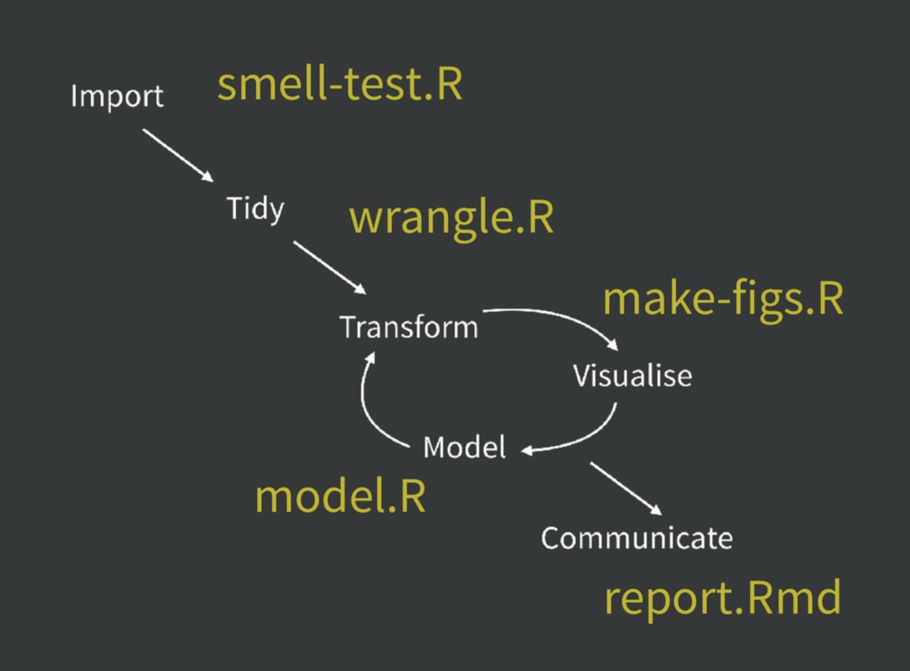
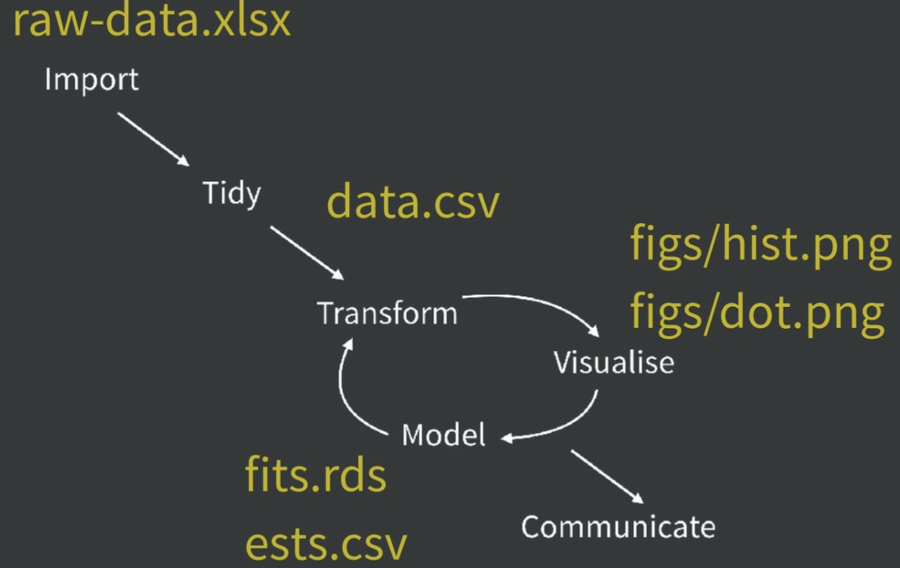
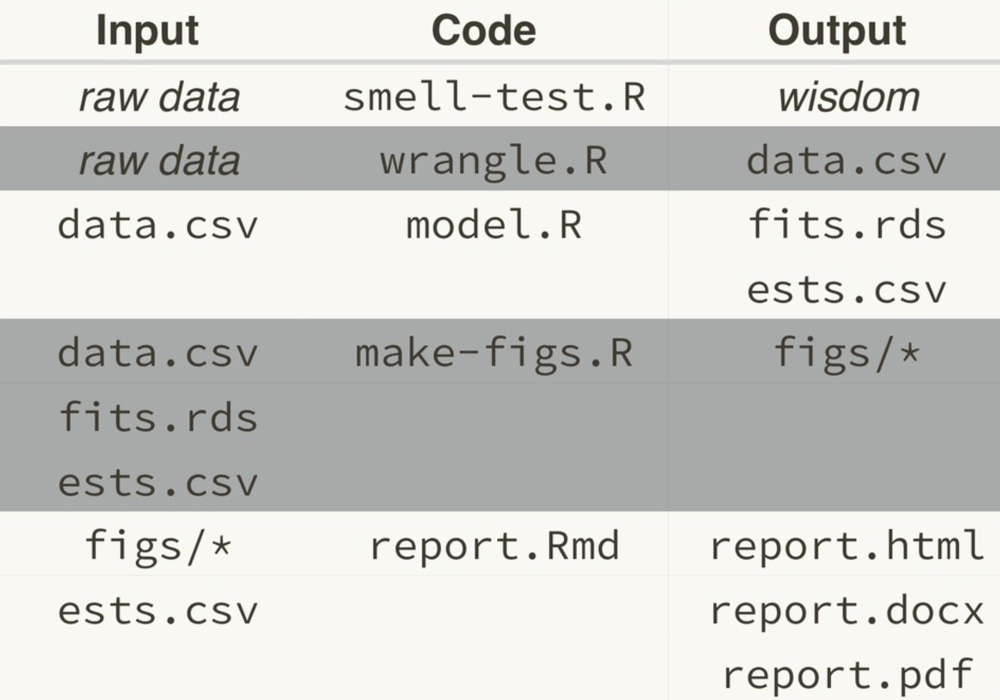

```{r setup, include=FALSE}
knitr::opts_chunk$set(echo = FALSE)
```

## Acknowledgments

Slides modified from Jenny Bryan talk available at <https://github.com/jennybc/zen-art-workflow>

---

# Expect to Iterate


---

# Break logic & output into pieces

--

## ! everything.R

--

# Instead

--

- smell-test.R
- wrangle.R
- model.R
- make-figs.R
- report.Rmd

---

## Workflow



---

# Break logic & output into pieces

--

## ! .Rdata

--

# Instead

--

- raw-data.xlsx
- data.csv
- fits.rds           
- ests.csv

---

## Workflow



---

## Workflow

