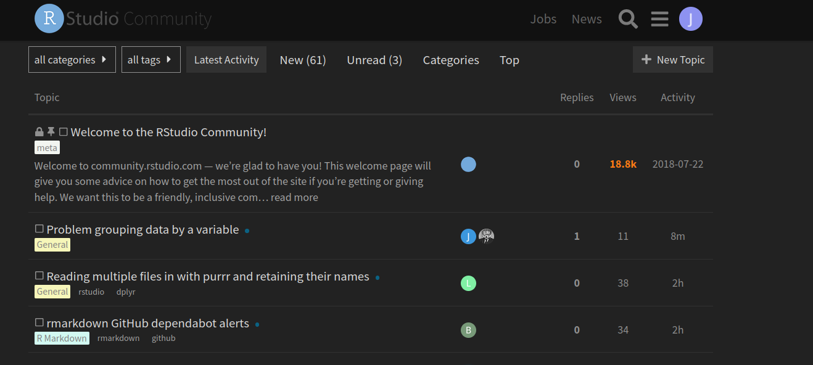
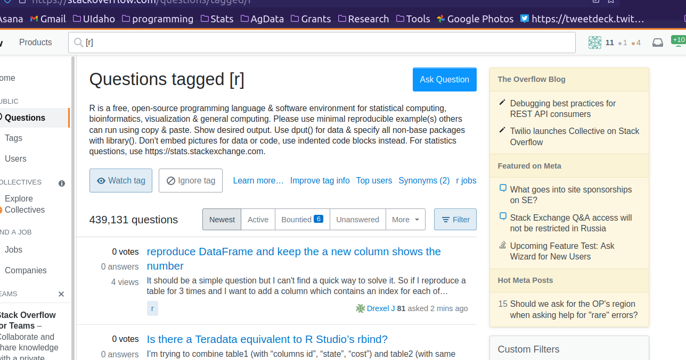

```{r setup, include=FALSE}
options(htmltools.dir.version = FALSE)
```

class: center, middle 

## What do you when you need to solve a problem in R? 


---
# Check the documentation!

*Remember, you can spend 2 hours searching the web in order to save 15 minutes of reading the documentation.*

How do we do this?

```{r eval=FALSE}
?par
??plot
```

---
# No really, read the docs

2 main aspects of documentation:   

1. Function reference
1. Vignettes

[CRAN](https://cran.r-project.org/web/packages/available_packages_by_name.html) can be a good place to start. 

[tidyr example](https://CRAN.R-project.org/package=tidyr)

---
class: center, middle, inverse

## [exercise](exercises/exercise-3.html)

---
# Read your error messages

*They are often telling you something important.*


---
# Still, error messages can be confusing


---
## Other help options

[RStudio Community](https://community.rstudio.com/)  
<br>  


---
## Other help options

[R4DS community](https://www.rfordatasci.com/)  
<br>   
  

---
## Other help options

[Stack overflow](https://stackoverflow.com/)  
<br>  


---
# Read the source code


*(this will help improve your coding, too)*

---
# How to find source code

* Type the function name in the console without parentheses: 
```{r eval=FALSE}
lm
```
*[suppressed output because it is long]*
<br><br>

* Sometimes this is not informative   
```{r}
c
subset
`[`
```

---
# Use 'lookup' to find what you need

*(Prior to 'lookup', finding source code was a real [bugger](https://github.com/jennybc/access-r-source#readme)*

**lookup** checks CRAN, Bioconductor and GitHub!

```{r eval=FALSE}
lookup::lookup(`[`)
```

---
#  Miscellaneous R tip

#### How to find other methods associated with an R object
--

All R objects have a class assigned to them: 

```{r}
y <- rnorm(20); x <- y + rnorm(20)
m <- lm(y ~ x)
class(m)
```

---

Once you know the object class, you can search on methods written for that class. 

```{r}
methods(class = "lm")
```

