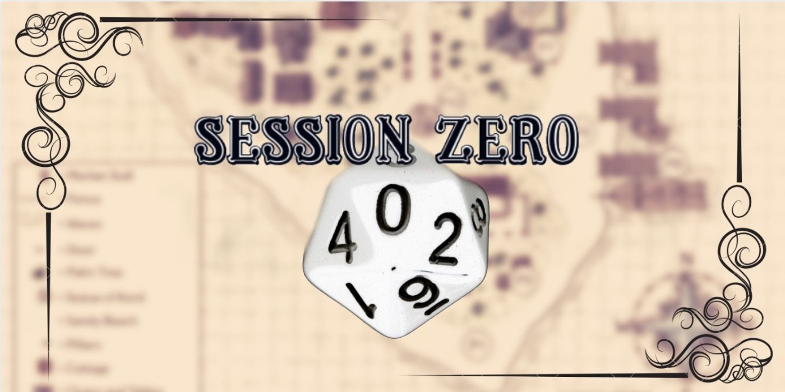
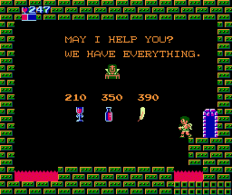

```{r setup, include=FALSE}
knitr::opts_chunk$set(echo = FALSE, message=FALSE, warning=FALSE)
```
class: center, middle



---
class: center, middle

# Introductions

---
class: middle

### 1. Name   
### 1. School + Department   
### 1. The one R package that *saved* you   

---
# (Target) Course Learning Outcomes

* Understand your R installation and package library
* Know how to make your R processes more reproducible
* Know how to implement multiple approaches for troubleshooting errors
* Know how to use R's debugger
* Know how to create a reproducible example
* .....what else do you want to know? 

---
# This Class: Years Using R

```{r include=FALSE}
library(ggplot2); library(googlesheets4); library(dplyr); library(RColorBrewer)
survey_url <- "https://docs.google.com/spreadsheets/d/1vOBNZHZOwdRSu1tYz63zu7Lzv2Ci4DAzD-SnIgVT_wk/edit?usp=sharing"
survey <- read_sheet(survey_url)
colnames(survey) = c("timestamp", "yearsR", "freqR", "feelingR", "challenges")

survey$yearsR <- factor(survey$yearsR, 
                       levels = c("less than 1 year", "1 year","2 years",
                                  "3 years", "4 years", "5 years or more"),
                       labels = c("<1", "1", "2", "3", "4", "5") )
survey$freqR <- factor(survey$freqR, 
                       levels = c("Daily (that is, every work day)", 
                                  "weekly", "monthly", 
                                  "less frequently than monthly", 
                                  "comes and goes depending on time of year and/or work reponsibilities"), 
                       labels = c("daily", "weekly", "monthly", "<monthly",
                                  "variable"))
levs <- unique(survey$feelingR)
survey$feelingR <- factor(survey$feelingR, levels = levs, 
                          labels = c("needlessly challenging", "Love it!", "no opinion",
                                     "works fine", "works but frutrating"))
```

```{r}
years <- table(survey$yearsR)
#brewer.pal(6, "Reds")
pie(years, col = c("#FEE5D9", "#FCBBA1", "#FC9272",
                   "#FB6A4A", "#DE2D26", "#A50F15"),
    init.angle = 90, clockwise = TRUE, radius = 1, cex = 2)
```

---
# This class: usage frequency

```{r}
exp <- table(survey$freqR)
#brewer.pal(6, "Reds")
pie(exp, col = c("#A50F15", "#DE2D26",  "#FB6A4A", "#FCAE91", "#FEE5D9"),
    init.angle = 90, clockwise = TRUE, radius = 1, cex= 2)
```

---
# This class: attitude towards R

```{r}
survey %>% count(feelingR) %>% mutate(N = n/sum(n) * 100) %>% 
  ggplot(aes(x = "", y = N , fill = feelingR)) +
    geom_bar(stat = "identity", width=1, color = "white") +
    coord_polar("y", start=0) +
    scale_fill_brewer(palette = "Set2") +
    theme_void(base_size = 20) +
    theme(legend.title = element_blank())
```

---
class: center, middle

# What do you want to learn in this course? 

---
# R is hard

[](https://gitter.im/Idaho-ag-stats/2022-what-they-forgot-workshop#)


