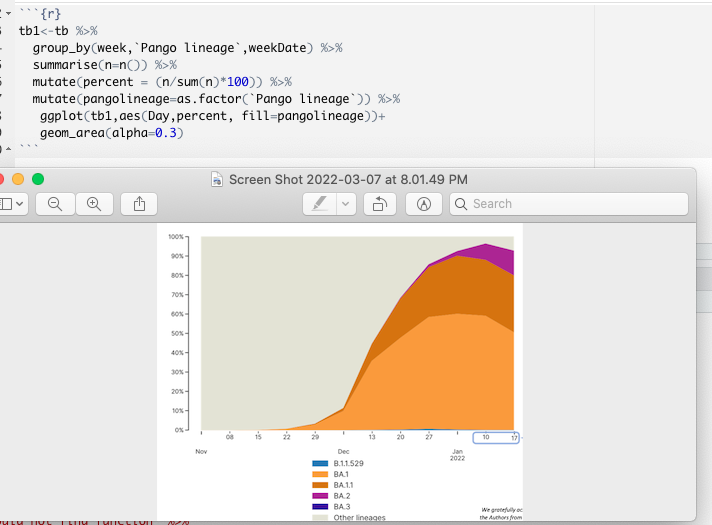

```{r setup, include=FALSE}
options(htmltools.dir.version = FALSE)
```

class: center, middle

## How to ask for help  
 
<br> <br>  
*the coding error*  
*unsolvable mystery*  
*make it simple, friend*  

---
# Getting Help (again)

Eventually, you will probably need outside help to solve a programming problem. 
<br>  
lotsa skilled people: Stack Overflow, R4DS, RStudio Community, that other grad student who knows everything,...
<br>   
You are asking them to help you, but in order for them to do that, they need to understand your problem.

---
# reprex = Reproducible example

  = minimum version of what you are doing in R that is generating an error


---
# Good reproducible example

1. use smallest, simplest data set. Preferably a built-in data set (e.g. iris or cars, yawn).  
1. If you have to create a data set, keep it small, keep it simple. 
  * minimum size (e.g. number of rows), minimum variables
  * enough information to replicate your situation - at least, the situation that is creating a problem

<center> Remember, the goal is to recreate your problem! </center>

---
# Tools to create a minimal data set

* `data.frame()`, `matrix()`, `list()` and other base R functions
* if you simulate new data through a random process, use `set.seed()`. 

```{r}
set.seed(208)
my_df <- data.frame(x1 = c(1, 2, 3, 4),
                    x2 = c("a", "a", "b", "b"),
                    x3 = rnorm(4))
my_df
```
--

**mini-exercise:** make a `data.frame` with at least 2 variables and 5 rows. 

---
# Tools to create a minimal data set

* find those data sets! Use `data()`, `data(package = "dplyr")` or search the documentation (data sets are listed). 

*(no point in running these in an Rmarkdown document)*

--
**mini-exercise:** find a data set from a tidyverse package you've never used before and examine is. How big is it? What type of variables are present? 

---
# Tools to create a minimal data set

* the package **[datapasta](https://milesmcbain.github.io/datapasta/index.html)**

Run in the console: 
```{r}
library(datapasta); library(dplyr)
```

Format a table to R code and put it on the clipboard
```{r, eval=FALSE}
iris %>% head() %>% df_format() 
```
[CTRL + V]

Pull part of table into R-formatted syntax: 
```{r, eval = FALSE}
# first, copy part of a table
# next type either line in the console and run
tribble_paste()
df_paste()
```

---
class: center, middle, inverse

## # [exercise](exercises/exercise-8.html)

---
# Narrow down the problem:

* DON'T provide a long list of commands and say "it didn't work"  
* DO find the line of code where it all breaks down (this does not mean digging into the source code - find the error in *your* code)  
* DO include all lines of code needed to recreate the problem - including libraries that must be loaded 
* DON'T run load meta-library like `library(tidyverse)` - only load the packages needed to recreate the problem
* DO <mark>ruthlessly</mark> strip out every bit of unneeded code, any extra lines, extraneous arguments that can be ignored while the error persists

---
# Be considerate of your anonymous helpers

.pull-left[
  ![please be kind rewind])(images/kind_rewind.jpg)
]

.pull-right[
* no `rm = list(ls())` since it is running on someone else's system
* no setwd("to/my/computer")
* if your code changes systems systems (e.g. `par(...)`, make sure you reset it
* don't mask built-in functions (e.g. `mean()`)  with your own custom functions
]

---
# Last step: using `reprex()`

* **reprex** is a package supporting how to generate reproducible examples. 
* like **datapasta**, it can make your life easier

Copy: 
```{r, eval = true}
x<- 1:10
plot(x)
```

Run:
```{r}
reprex::reprex()
```

Paste your clipboard where you are seeking help (e.g. [GitHub issue](https://github.com/IdahoAgStats/what-they-forgot-202203/issues), Stack Overflow Question)

---
# Example



---
class: middle, center, inverse

# [exercise](exercises/exercise-9.html)

---
# Use good style 
### (it's easier to read)

1. There is no limit on white space 
1. pay attention to function examples in documentation for code styling 
1. there's actually a [code guide!](https://style.tidyverse.org/syntax.html) and a package, [styler](https://styler.r-lib.org/) to support this. 

Tip: <mark>CTRL + Shift + a</mark> will reformat things. 

---
# The Good, The Bad and the Weird

* Creating a good reprex is **a lot** of work!
* If you want to elicit feedback to solve your problem, this is how to do that. 
* Very frequently, the process of creating a reprex will reveal an error, a mistaken assumption, or something that will help you resolve the problem! 

---
# Guides for creating a good reprex

* [Stack Overflow](https://stackoverflow.com/help/minimal-reproducible-example)
* [Rstudio Community](https://community.rstudio.com/t/faq-how-to-do-a-minimal-reproducible-example-reprex-for-beginners/23061)
* [Reprex Do's and Don'ts](https://reprex.tidyverse.org/articles/reprex-dos-and-donts.html)
