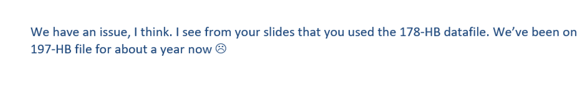

```{r setup, include=FALSE}
options(htmltools.dir.version = FALSE)
knitr::opts_chunk$set(echo = FALSE, message=FALSE, warning=FALSE)
knitr::opts_chunk$set(tidy.opts = list(width.cutoff = 60), tidy = TRUE)
```

# What is Data Workflow? 

* Process of of data management and analysis from gathering raw data to eventual storage in a long-term repository
* Coordinated procedures for
  * Planning, organizing, and documenting research
  * Data preparation
  * Data analysis 
  * Data backup and archive 
  
---
# Why Do We Need It?

* It’s essential to reproducibility
* It helps us actually get the right answers
* Reliable workflow results in efficient use of time
* Errors are inevitable. A good workflow can help you find them and correct them

---
# What is Reproducible Research? 

> ...reproducibility is obtaining consistent results using the same input data; computational steps, methods, and code; and conditions of analysis. This definition is synonymous with “computational reproducibility” 

                    -- Reproducibility and Replicability in Science (2018)
                    Consensus Study Report of the National Academies of Sciences

.right[.ref[*[Reference](https://www.nationalacademies.org/our-work/reproducibility-and-replicability-in-science)*]]

---
# Reason for Good Workflow Practices

Avoid things like this: 

```{r, echo=FALSE, out.width="90%"}

```

---
# Reason for Good Workflow Practices

Clarify how data were processed:

```{r, echo=FALSE, out.width="90%"}
knitr::include_graphics('images/colorful_spreadsheet.png')
```


---
# The "Replication Crisis"

The inability to replicate a study's findings. 

```{r, echo=FALSE, out.width="90%"}
knitr::include_graphics('images/Ioannidis2010.png')
```

.right[.ref[(2005, PLOS Medicine)]]

**Causes:** bad statistics, incorrect interpretation, lab assays poorly described, lab assay results can't be replicated, *poor documentation of data processing*

---
# A Typical Data Analysis

```{r, echo=FALSE}
knitr::include_graphics('images/horst-eco-r4ds.png')
```
.right[.ref[*(Artwork by Allison Horst)*]]

---
# A Typical Data Analysis

Time allocation: 

```{r eval=FALSE, include=FALSE}
Pie <- c(80, 10, 10)
names(Pie) <- c("Data Preparation", "Reporting", "Analysis!")

pie(Pie, init.angle = 55, angle = c(110, 10, 45), density = 75, family = "xkcd", 
    col = c("cornflowerblue", "gray65", "gold"), border = "black", cex = 2)

# run and save manually
```

```{r, echo=FALSE, out.width="90%"}
knitr::include_graphics('images/pie_chart.png')
```

Data preparation is a *major* part of the analytic process.

---
# What Happens During 'Data Preparation'?

* data entry
* data import
* data calculations using constants (growing degree days, Julian calendar days)
* data reformatting (e.g., wide to long)
* merging of data sets
* some data transformations: summary of technical reps, consistency checks, calibration curves

---
# Famous Errors in Analysis

* WSU: Analysis of livestock predation by wolves by Robert Weilgus, checked by the Washington Policy Center for Environmental policy and WSU Statistician Marc Evans. The results disagreed, eventually leading to Prof Weilgus' resignation. 
* In the Fall of 2020, the UK accidentally omitted 16,000 COVID cases from their official "database" (Microsoft Excel), drastically altering their official COVID counts. 

---
# Famous Errors in Analysis

> We replicate Reinhart and Rogoff and find that coding errors, selective exclusion of available data, and unconventional weighting of summary statistics lead to serious errors that inaccurately represent the relationship between public debt and GDP (gross domestic product) growth among 20 advanced economies in the post-war period,"

              --Thomas Herndon, Michael Ash, and Robert Pollin
                
*Original study was cited by Rep. Paul Ryan in his 2013 budget and used to justify austerity measures*

.right[.ref[*[Reference](http://peri.umass.edu/fileadmin/pdf/working_papers/working_papers_301-350/WP322.pdf)*]]

---
# Sign of Workflow Issues

* Incorrect results with creative explanations  
* Delayed publication of papers to determine why results changed  
* Results that cannot be reproduced with the same data set – due to unrecorded changes made to the data  
* Results that cannot be reproduced with the same data set – due to unwieldly 1000-line script for data cleaning  
* Results for the wrong variable  
* Miscoded data that delay progress  
* Loss of early raw files that prevents any future error checking  


---
class: middle, center, inverse

# What can we do about this? 

---
background-image: url(images/spiderman_2.jpg)
background-position: top center
class: center, bottom, inverse

Can a person using README files, a data dictionary, code and/or other descriptors repeat the analytical processes AND obtain the same results for a given study?? 

---

# The Reproducible Research Plan 

1.  Plan. 
1.  Archive data and methods.
1.  Document processes.
1.  Publish data and methods.

----------------

#### 3  Document the Process

* **The source is real:** Save computing scripts for all processing, analytical and reporting steps. These scripts are ~~as important as the~~ data. 
* Made a data dictionary for data sets that explains a data set's variables, their data types and expected values. 
* Prepare a "README' file to accompany a data set 

---
# Dealing with Spreadsheets

* Spreadsheets are a fact of life
* Good for data storage, bad for data curation 
* Some [best practices](https://www.tandfonline.com/doi/full/10.1080/00031305.2017.1375989):

```{r, echo=FALSE, out.width='90%'}
knitr::include_graphics('images/spreadsheets.png')
```

---
##  What a Reproducibility Script Should Capture

* The datafile(s) imported
  * if your data is downloaded from elsewhere, comprehensive description of how it was accessed
* Add-on libraries used in data processing and analysis
* If you use a homespun script form someone else, that is a data file to include
* Data manipulations used to generate the final data products
  * any variable transformations
  * data aggregation
  * filtering steps
  * file merges
* anything that contributes to the generation of the final dataset that will be uploaded to a long-term data repository
  
---
##  What a Reproducibility Script Does Not Need to Capture  

* data explorations that aren't directly used to prepare data
  * histograms, range checks, cross tabulations, etc
* Package installations (note that this is different from packags loaded and used)
* failed code
* analysis paths that were ultimately abandoned 

---
# Code Itself is Not Always Enough

In a study that attempted to rerun R code from 2,899 studies, only 470 ran as expected *(data from [Chris Chen](https://dash.harvard.edu/bitstream/handle/1/38811561/CHEN-SENIORTHESIS-2018.pdf?sequence=3))*

```{r eval=FALSE, include=FALSE}
# run manually and save

library(networkD3); library(dplyr)

reprod <- data.frame(source = c("Attempted", "Attempted", rep("Failure", 4)), 
                     target = c("Success", "Failure", "Error: library", "Error: working directory", 
                                "Error: missing file", "Error: other"),
                     counts = c(470, 2429, 363, 696, 801, 569))

nodes <- data.frame(
  name=c(as.character(reprod$source), 
  as.character(reprod$target)) %>% unique()
)
 
reprod$IDsource <- match(reprod$source, nodes$name)-1 
reprod$IDtarget <- match(reprod$target, nodes$name)-1

p <- sankeyNetwork(Links = reprod, Nodes = nodes,
              Source = "IDsource", Target = "IDtarget", nodeWidth = 20,
              Value = "counts", NodeID = "name", fontFamily = "xkcd",
              sinksRight=FALSE, fontSize = 25, nodePadding = 20)
p
```

```{r, echo=FALSE, out.width="75%"}
knitr::include_graphics('images/sankey.png')
```

---
# Tips for Computational Reproducibility

* Restart your programming session often
* disable automatic saving of `.RData`  
* Use R Projects (or equivalent in other IDE's)
* Capture R session information with `SessionInfo()` OR consider the **renv** package 
  for capturing the computing environment
* see the [Reproducible Research](https://cran.r-project.org/web/views/ReproducibleResearch.html) CRAN task view for more resources

---
class: middle, center, inverse

## You will (probably) thank your future self. 
